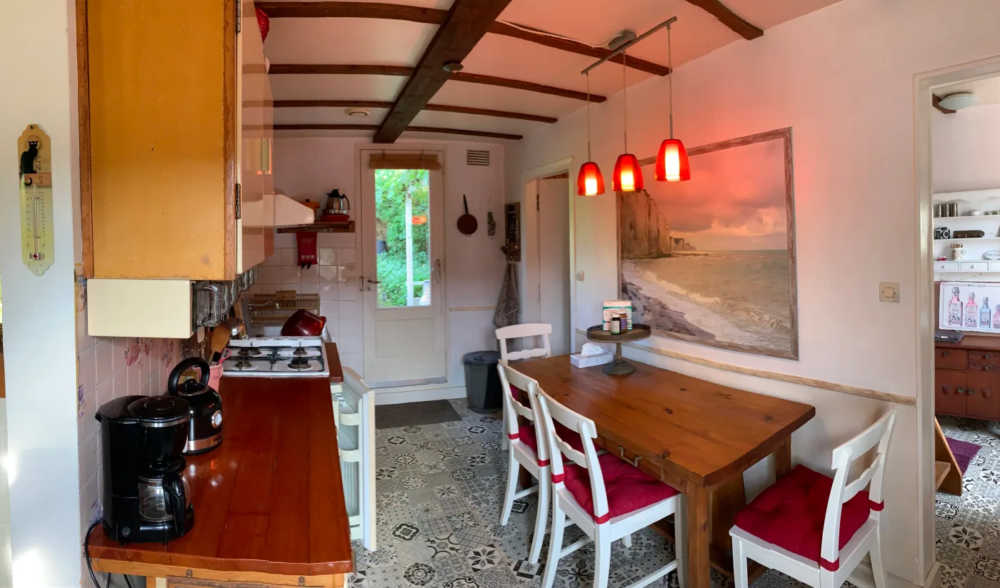
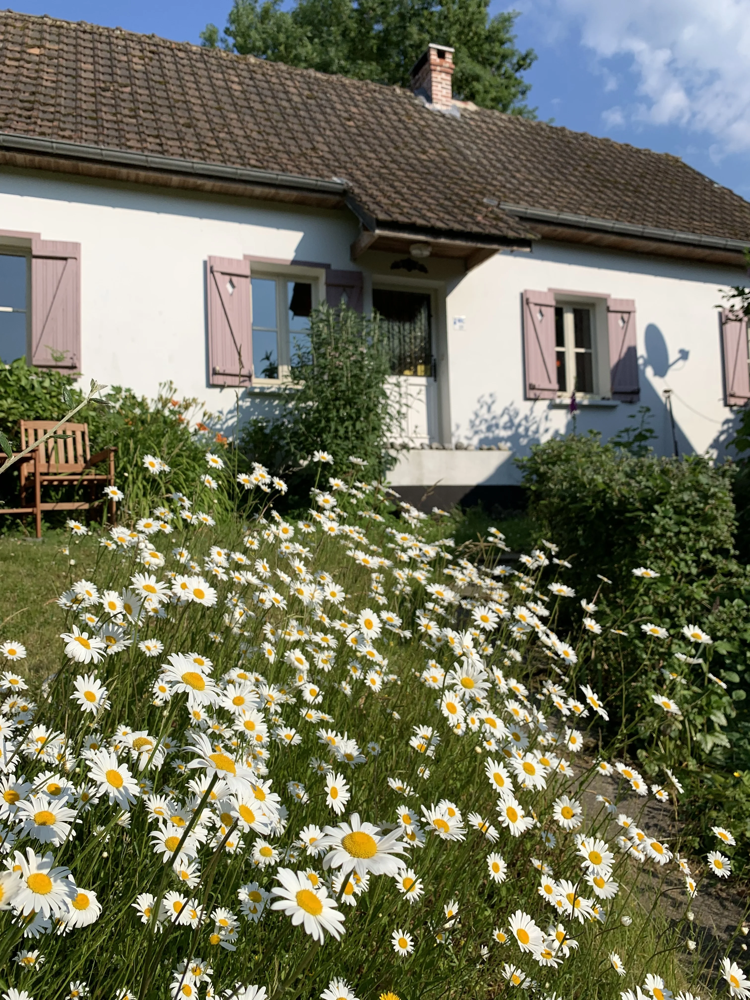

# Fermette Hirondelle — Website Improvement Plan

> Goal: more Google visibility, better mobile experience, faster load times, and higher booking conversions.

---

## 0. Preparation — Archive the old site & pick a framework

Before touching code, do two things: lock down a copy of what exists today, and decide what we're building on top of.

### 0.1 Archive the current website

The old version still has value:
- **Photos** — all WebP and JPG images of the house, garden, surroundings
- **Copy/text** — the Dutch descriptions of the house and the area (Bouillancourt, Saint Valéry, Le Crotoy, Abbeville)
- **Reviews** — six guest reviews with dates and scores
- **Pricing structure** — high/mid/low season + extra costs breakdown
- **Practical details** — facilities lists, house rules, contact info

**Steps:**
1. Commit the current state to git so it's permanently archived in history:
   ```bash
   git add .
   git commit -m "Archive original website"
   git tag v1-original
   git branch backup-original
   ```
2. Create an `assets-archive/` folder (outside the new build) and copy:
   - All images from `images/`
   - The copy text from `index.html` extracted into a plain `content.md` file (so it's easy to paste into the new site)
   - The reviews extracted into `reviews.json` or `reviews.md`
3. Once the new site is live and tested, the old `index.html`, `flickity.css`, `flickity.pkgd.min.js`, and unused JPG originals can be deleted.

### 0.2 Stack decision: Plain HTML + Tailwind CSS ✅

**Locked in: plain HTML + Tailwind CSS, FTP-deployable.**

Reasoning:
- Single-property site, mostly content + a booking form — no need for a JS framework
- FTP-friendly: just edit files and upload
- Tailwind CDN means zero build tools to start
- Excellent SEO (pure HTML is what Google loves most)
- Future-proof: if the site ever grows into a multi-property platform, the HTML/Tailwind classes migrate cleanly to Astro or Next.js later

**Stack:**

| Layer | Choice |
|-------|--------|
| HTML | Plain (cleaned-up version of current `index.html`) |
| Styling | **Tailwind CSS** (via CDN initially, optional CLI build later) |
| Icons | Font Awesome (already in use) |
| Image carousel | Flickity (already in use) |
| Map | Leaflet (already in use) |
| Booking form | Formspree (already in use) |
| Calendar | styledcalendar.com embed (already in use) |
| Hosting | FTP host (or GitHub Pages as free alternative) |

**Migration approach:** keep W3.CSS loaded alongside Tailwind during the transition. Convert one section at a time to Tailwind classes. Once everything is converted, remove W3.CSS.

### 0.3 New project structure

```
Fermette_Hirondelle/
├── assets-archive/          ← old photos & content, kept for reference (optional)
├── css/
│   └── styles.css           ← custom CSS that doesn't fit Tailwind utilities
├── images/                  ← all photos (WebP preferred)
├── javascript/              ← renamed from "javasript" typo
│   └── all.js
├── index.html               ← single-page site
├── robots.txt               ← new
├── sitemap.xml              ← new
└── IMPROVEMENT_PLAN.md
```

---

## 1. SEO — Search Engine Optimisation

### 1.1 Fix the `<html>` language attribute
The `<html>` tag has no `lang` attribute. Google uses this to understand who the page is for.
```html
<!-- now -->
<html>

<!-- fix -->
<html lang="nl">
```

### 1.2 Rewrite the `<title>` and meta description
The current title is generic and the meta description tag uses uppercase (`DESCRIPTION`), which is outdated.
```html
<!-- fix -->
<title>Vakantiehuis Hirondelle — Picardie, Frankrijk | Huren in Bouillancourt</title>
<meta name="description" content="Huur dit sfeervolle 4-persoons vakantiehuis in Bouillancourt, Picardie. Op 15 min van strand en krijtrotsen. Volledig ingericht, tuin, open haard, wifi.">
```
- Keep description **between 140–160 characters**
- Include location keywords: Picardie, Bouillancourt, krijtrotsen, Baai van de Somme

### 1.3 Add Open Graph & Twitter Card tags
These control how the page looks when shared on Facebook, WhatsApp, Instagram stories, etc.
```html
<meta property="og:title" content="Vakantiehuis Hirondelle — Picardie, Frankrijk">
<meta property="og:description" content="Sfeervolle fermette voor 4 personen in Bouillancourt. Tuin, open haard, wifi, 15 min van het strand.">
<meta property="og:image" content="https://yourdomain.nl/images/web_front_image.webp">
<meta property="og:url" content="https://yourdomain.nl/">
<meta property="og:type" content="website">
```

### 1.4 Add Schema.org structured data (JSON-LD)
This tells Google exactly what type of business you are and can unlock rich results (star ratings, price, location pin).
```html
<script type="application/ld+json">
{
  "@context": "https://schema.org",
  "@type": "LodgingBusiness",
  "name": "Vakantiehuis Hirondelle",
  "description": "Sfeervolle fermette voor 4 personen in Bouillancourt, Picardie",
  "url": "https://yourdomain.nl",
  "image": "https://yourdomain.nl/images/web_front_image.webp",
  "address": {
    "@type": "PostalAddress",
    "streetAddress": "Rue du Gue",
    "addressLocality": "Bouillancourt",
    "addressCountry": "FR"
  },
  "numberOfRooms": 3,
  "amenityFeature": [
    {"@type": "LocationFeatureSpecification", "name": "WiFi", "value": true},
    {"@type": "LocationFeatureSpecification", "name": "Open haard", "value": true}
  ]
}
</script>
```

### 1.5 Add a canonical URL tag
Prevents duplicate content issues if the site is ever reachable via multiple URLs.
```html
<link rel="canonical" href="https://yourdomain.nl/">
```

### 1.6 Create a `sitemap.xml`
Even for a single-page site, a sitemap helps Google discover and index the page faster. Place it at `/sitemap.xml` and submit it via Google Search Console.
```xml
<?xml version="1.0" encoding="UTF-8"?>
<urlset xmlns="http://www.sitemaps.org/schemas/sitemap/0.9">
  <url>
    <loc>https://yourdomain.nl/</loc>
    <changefreq>monthly</changefreq>
    <priority>1.0</priority>
  </url>
</urlset>
```

### 1.7 Create a `robots.txt`
Currently missing. Needed to guide crawlers.
```
User-agent: *
Allow: /
Sitemap: https://yourdomain.nl/sitemap.xml
```

### 1.8 Remove outdated meta tags
`REVISIT-AFTER` is ignored by all modern crawlers and makes you look outdated. Remove it.

### 1.9 Add `alt` text to every image
Every `` in the HTML has no `alt` attribute. This is a ranking signal and an accessibility requirement.
```html
<!-- fix example -->

```

### 1.10 Fix heading hierarchy
There are two `<h1>` tags (one hidden for mobile). Use a single `<h1>` and control font size with CSS instead.

---

## 2. Image Optimisation

### 2.1 Convert remaining `.jpg` images to WebP
The main gallery images are already `.webp` — good. But the carousel (Omgeving) still loads `.jpg` files:
- `bouillancourt.jpg`, `valery_haven.jpg`, `le_crotoy.jpg`, `abbeville.jpg`, `miannay.jpg`, `ault.jpg`, `amiens.jpg`

Convert them all. WebP is typically 25–35% smaller with the same visual quality.

**Tool:** Use [Squoosh.app](https://squoosh.app) or the `cwebp` CLI for batch conversion.

### 2.2 Add `width` and `height` attributes to all images
This prevents Cumulative Layout Shift (CLS), which is a Core Web Vital Google measures.
```html

```

### 2.3 Add lazy loading to below-fold images
Only the first hero image should load eagerly. Everything else should be lazy.
```html

```

### 2.4 Use `<picture>` with responsive `srcset` for the hero image
Serve smaller images to mobile users so they don't download full desktop-size photos.
```html
<picture>
  <source media="(max-width: 600px)" srcset="images/web_front_image_sm.webp">
  
</picture>
```

### 2.5 Compress & resize source images
The `.jpg` originals (like `front_image.jpg`) may still be very large. Check file sizes and resize anything over 1500px wide to save bandwidth.

### 2.6 Upgrade sidebar background image
`css/styles.css` uses `front_image.jpg` (the original JPG) as the sidebar background. Switch this to `web_front_image.webp`.

---

## 3. Mobile Responsiveness

### 3.1 Fix the mobile navigation
On small screens the hamburger menu icon appears top-right, but there is no branding visible at all. Add a small logo or the house name in the top-left of the mobile header so users know where they are.

### 3.2 Fix the `padding-top: 250px` gap
In the Huis section there is a hardcoded `style="padding-top: 250px"` on the "Over dit huisje" heading. This creates a huge blank gap on mobile. Move it to CSS with a media query:
```css
@media (max-width: 600px) {
  .over-huisje { padding-top: 40px; }
}
```

### 3.3 Test and fix the booking form on small screens
The form uses `.w3-half` columns side by side. On screens under 400px these can overlap. Test on real devices and add a breakpoint if needed.

### 3.4 Make the Omgeving carousel mobile-friendly
Flickity works on touch, but the fixed-width images (`width="264"`) in the carousel cells mean they don't stretch or shrink. Change to `width: 100%; height: auto;` and let CSS control sizing.

### 3.5 Test on actual devices
Run Google's [Mobile-Friendly Test](https://search.google.com/test/mobile-friendly) and fix any flagged issues. Also run Chrome DevTools > Lighthouse in Mobile mode.

---

## 4. Performance & Core Web Vitals

### 4.1 Eliminate render-blocking resources
jQuery is loaded twice — once in `<head>` (line 18) and again at the bottom of `<body>` (line 554). Remove the duplicate `<head>` jQuery script tag.

### 4.2 Load non-critical CSS asynchronously
Font Awesome and Google Fonts block rendering. Use the `preload` trick:
```html
<link rel="preload" href="https://cdnjs.cloudflare.com/ajax/libs/font-awesome/..." as="style" onload="this.onload=null;this.rel='stylesheet'">
```

### 4.3 Self-host fonts
Google Fonts adds an extra DNS lookup and may be blocked by privacy-focused browsers. Download the Montserrat font files and host them yourself.

### 4.4 Add resource hints
```html
<link rel="preconnect" href="https://fonts.googleapis.com">
<link rel="dns-prefetch" href="https://embed.styledcalendar.com">
```

### 4.5 Minify CSS and JS
The custom `css/styles.css` and `javasript/all.js` are unminified. Run them through a minifier (e.g. [cssnano](https://cssnano.co) / [Terser](https://terser.org)) to reduce file size.

---

## 5. Trust, Conversion & Content

### 5.1 Display review scores numerically
The reviews show stars but the score (8/10, 9/10) is buried in the text. Show it prominently near the stars so visitors see it at a glance.

### 5.2 Add review structured data
Google can show star ratings in search results if you add `Review` schema to the existing review data. This is a high-impact SEO win.

### 5.3 Add a price range to the hero section
Visitors want to know cost before scrolling deep. Add a "Vanaf €495 per week" line near the top to qualify leads faster.

### 5.4 Add a Google Business Profile listing
Create or claim a free [Google Business Profile](https://business.google.com) for the property. This shows the house on Google Maps and in the local pack — very high visibility for holiday home searches.

### 5.5 Add a "Book now" CTA button in the hero
Make it easy for interested visitors to jump straight to the booking form.
```html
<a href="#boeken" class="w3-button w3-black w3-padding-large">Direct boeken</a>
```

---

## 6. Technical Housekeeping

### 6.1 Fix the typo in the JS folder name
The folder is named `javasript` (missing a 'c'). Rename it to `javascript`. Update the script src in `index.html` accordingly.

### 6.2 Move the Google Analytics `<script>` tags inside `<head>`
Currently the gtag scripts are placed between `</head>` and `<body>` which is invalid HTML. Move them inside `<head>`.

### 6.3 Add a `<meta charset>` before any other tags
The charset declaration should be the very first thing inside `<head>` — currently it's on line 9 after several other metas.

### 6.4 Set up Google Search Console
Link the site to [Google Search Console](https://search.google.com/search-console) to:
- Submit the sitemap
- Monitor indexing status
- See which search queries bring traffic
- Spot crawl errors early

### 6.5 Ensure HTTPS and a custom domain
If the site is still served from GitHub Pages with a `github.io` URL, set up a custom domain (e.g. `fermettehirondelle.nl`) with HTTPS. Google gives a small ranking boost to HTTPS sites with real domain names.

---

## Priority Order

| Priority | Task | Impact | Effort |
|----------|------|--------|--------|
| 🔴 High | Add `alt` text to all images | SEO + accessibility | Low |
| 🔴 High | Fix `<html lang>` and `<title>` | SEO | Low |
| 🔴 High | Add structured data (Schema.org) | Rich results | Medium |
| 🔴 High | Remove duplicate jQuery | Performance | Low |
| 🔴 High | Convert remaining JPGs to WebP | Performance | Low |
| 🟡 Medium | Add lazy loading to images | Performance | Low |
| 🟡 Medium | Add Open Graph tags | Social sharing | Low |
| 🟡 Medium | Create sitemap.xml + robots.txt | SEO | Low |
| 🟡 Medium | Fix mobile navigation branding | UX | Medium |
| 🟡 Medium | Add Google Business Profile | Local SEO | Medium |
| 🟢 Lower | Self-host fonts | Performance | Medium |
| 🟢 Lower | Minify CSS/JS | Performance | Medium |
| 🟢 Lower | Add hero CTA button | Conversion | Low |
| 🟢 Lower | Add `srcset` responsive images | Performance | Medium |
